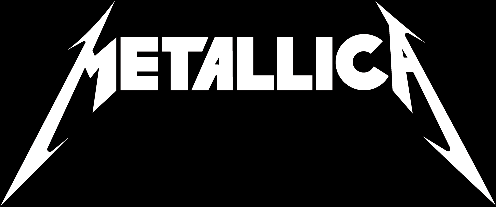

# Free API for Metallica fans and Developers




<a href="https://rollingstone.uol.com.br/artigo/trinta-anos-do-album-preto-metallica-no-topo-do-mundo/" target="_blank">image source</a>

## Dedication and Thanks

- I've been a big fan of metallica since I was a child, more than two decades listening to these guys' magnificent sound.
- I dedicate this API to all fans who appreciate the music, mission and work of these rock stars 🤘
- I also dedicate this small programming work in honor of the great Cliff Burton, one of the greatest bass players who ever walked the earth, who left us after an accident on September 27, 1986. Rest in Peace!

## Support the Project

- If you are able to support the project, you can make a PIX for the key below:

```
filipebacof@gmail.com
```

## Sugestões e Parcerias

- Feel free to contact me via email `filipebacof@gmail.com` or contact me on LinkedIn [on this link](https://www.linkedin.com/in/filipe-bacof/)

## It's not over here

- This project will be updated eventually and some things will be implemented soon, such as
- [x] Seeder for database initialization.
- [ ] Pagination of results for some endpoints.
- [ ] Endpoints to perform CRUD operations, obviously with authentication.

## About deployment

- Currently the deployment is done at [Render](https://render.com/) and their only free server is in the United States, so there may be a small delay in the first request, you can test the `/` endpoint which should return `Let's Rock! 🤘😎🔥`.
- Base URL for consuming the API: `https://metallica-api.onrender.com`
- [Click Here](https://metallica-api.onrender.com/) to test it

## Endpoint documentation

- You can access the exported postman file called `Metallica API.postman_collection.json` or access one of these links:
- [Documentation in English](https://github.com/Filipe-Bacof/metallica-api/blob/main/Documentation.md)
- [Documentation in Portuguese](https://github.com/Filipe-Bacof/metallica-api/blob/main/Documentação.md)
