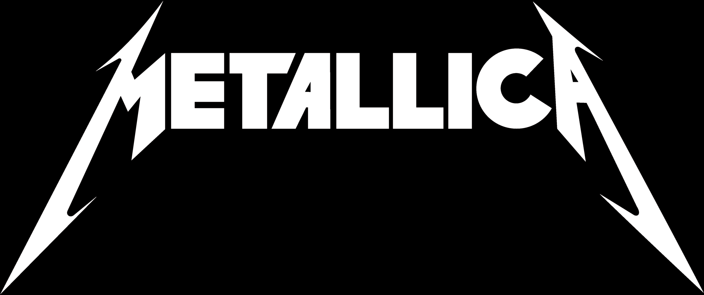

# Free API for Metallica fans and Developers




<a href="https://rollingstone.uol.com.br/artigo/trinta-anos-do-album-preto-metallica-no-topo-do-mundo/" target="_blank">image source</a>

## Dedication

- I've been a big fan of metallica since I was a child, more than two decades listening to these guys' magnificent sound.
- I dedicate this API to all fans who appreciate the music, mission and work of these rock stars 🤘
- I also dedicate this small programming work in honor of the great Cliff Burton, one of the greatest bass players who ever walked the earth, who left us after an accident on September 27, 1986. Rest in Peace!

## Base URL

```
https://metallica-api.onrender.com
```

## Endpoints

~coming soon

## Songs with unofficial youtube links:

- (Anesthesia) Pulling Teeth (Instrumental)
- Escape
- 2 X 4
- The House Jack Built
- Wasting My Hate
- Devil's Dance
- Better than You
- Low Man's Lyric
- It's Electric (Diamond Head)
- Sabbra Cadabra/A National Acrobat (Black Sabbath)
- The Prince (Diamond Head)
- Killing Time (Sweet Savage)
- Invisible Kid
- My World
- Shoot me Again
- Iced Honey (lulu 💩)
- Hate Train
- Just a Bullet Away
- Rebel of Babylon

## Songs that have &quot;

- Cure
- Pumping Blood (lulu 💩)

#### Não esqueça de ver se a musica **Lux Æterna** vai aceitar o caractere especial no DB
